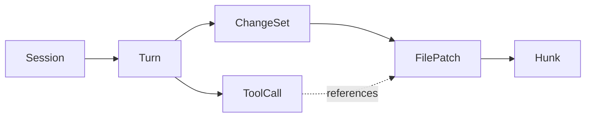
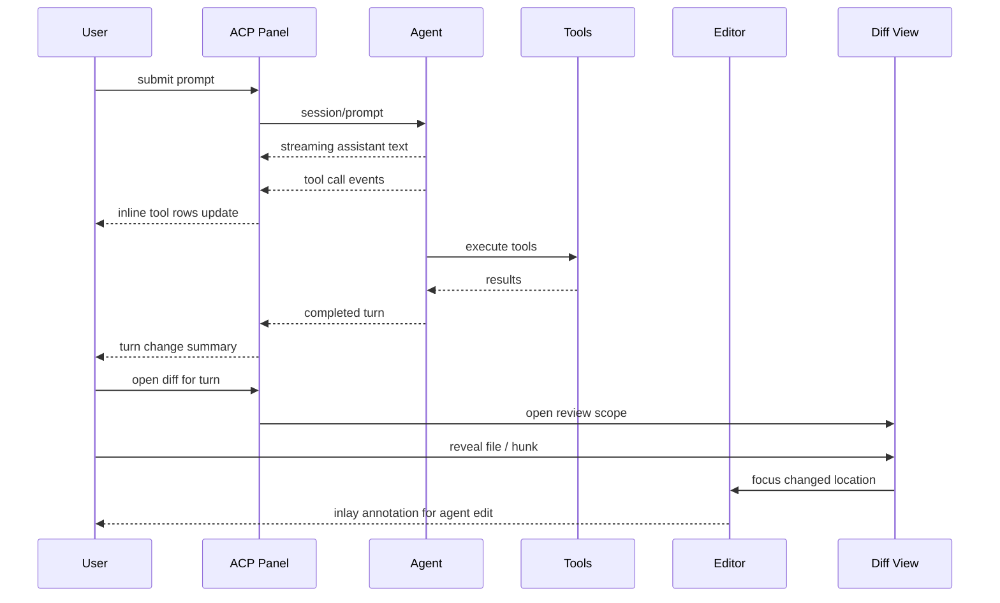
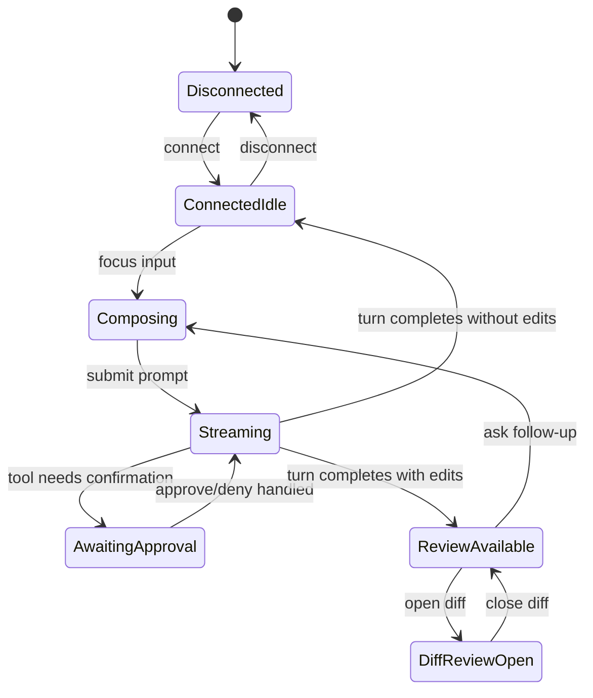
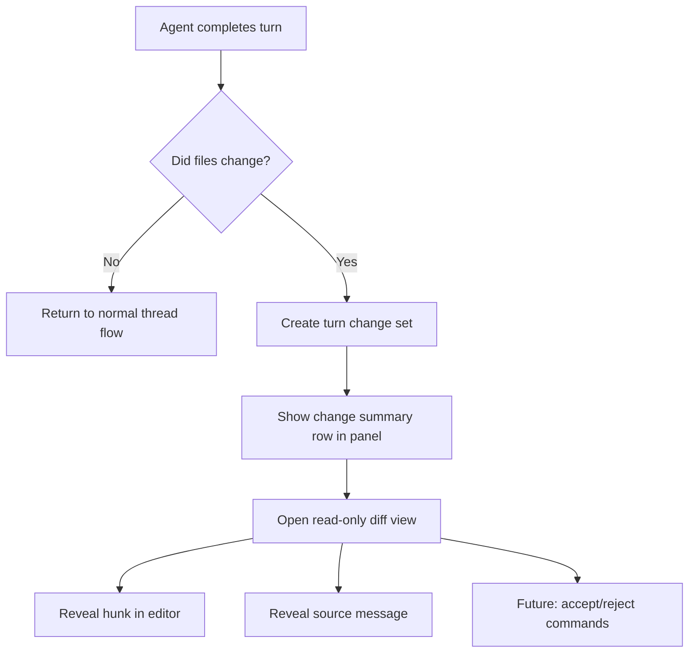

# ACP Agentic Panel UX Spec

Status: draft

This document defines the UX direction for Helix's agentic ACP workflow.
It is intentionally focused on user experience, mental model, panel behavior,
change review, and command surfaces rather than keybindings.

## Goals

- Keep the message list as the primary interaction model.
- Make agent activity legible without forcing users into a separate mode.
- Surface tool actions and edits as contextual annotations, not permanent noise.
- Provide a Git-style diff review surface for agent-made changes.
- Preserve room for a later accept/reject flow without designing around it today.

## Non-Goals

- Recreating Avante's synthetic-conflict application flow.
- Locking in final keybindings.
- Designing final colors, border styles, or theme-specific visuals.
- Implementing hunk acceptance in the first diff review milestone.

## Design Principles

1. Message list first. The thread is the source of truth.
2. Contextual affordances. Commands appear on hover/focus where they matter.
3. Review before mutation. Agent edits should be inspectable as diffs.
4. Per-turn provenance. Every edit should map back to a turn and tool call.
5. Readable under terminal constraints. Dense, low-chrome, high signal.

## Core UX Objects

- Session: one connected ACP conversation.
- Turn: one user prompt and the agent work that follows.
- Tool call: a single command, edit, search, or external action inside a turn.
- Change set: all edits produced by a turn.
- Review scope: the subset of changes being viewed: message, turn, session, or workspace.



## Primary Panel UX

The ACP panel should feel like a structured activity log with an attached composer.
The message list stays central. Tool rows, status rows, and change summaries are all
secondary entry types inside the same scrollable thread.

### Panel Regions

1. Header
   - Connected agent
   - Mode/profile
   - Model
   - Session status
2. Message list
   - User messages
   - Assistant messages
   - Tool call rows
   - Tool approval rows
   - Turn-level change summaries
3. Composer
   - Prompt input
   - Context pills
   - Send / cancel state

### Message Row Types

- User row: editable prompt card.
- Assistant row: streaming or completed response body.
- Tool row: compact execution event with status, target, and summary.
- Approval row: pending confirmation request with outcome options.
- Change summary row: files changed, lines changed, review commands.

### Tool Row Behavior

Tool rows are collapsed by default. On focus or hover, show right-aligned
annotations such as:

- `expand details`
- `show output`
- `open diff`
- `jump to file`
- `copy command`

Expanded tool rows show a short preview, never the full dump by default.
Large outputs open in a dedicated buffer, popup, or secondary panel surface.

### In-Editor Annotations

The editor should not always show agent action chrome. Instead:

- On hover/focus of a tool row, highlight related file regions.
- On cursor entering an agent-edited range, show a subtle inlay/annotation.
- On files touched by the current turn, show a file-level marker indicating review is available.

Example annotation copy:

- `Agent edited in turn 12 - open diff - reveal message`
- `Command ran here - show output`

## Visual Wireframes

### 1. Main Panel - Idle / Normal

```text
+------------------------------------------------------------------+
| ACP | Claude Agent | Write | Sonnet | Connected                  |
+------------------------------------------------------------------+
| You                                                              |
| Refactor the ACP panel so tool output is easier to review.       |
|------------------------------------------------------------------|
| Assistant                                                        |
| I'll inspect the panel flow and summarize the changes.           |
|                                                                  |
| [tool] grep docs/acp          Done      3 matches                |
| [tool] read agent_panel.md    Done      preview available        |
| [tool] edit panel.rs          Done      2 files changed          |
|                                                                  |
| Turn changes: 2 files | +46 -12                                  |
| Commands: review changes | reveal files | open diff              |
|------------------------------------------------------------------|
| @panel.rs  @diff.rs                                                |
| > Ask the agent to explain the last edit                         |
+------------------------------------------------------------------+
```

### 2. Tool Row - Focused / Hovered

```text
+------------------------------------------------------------------+
| [tool] bash cargo test -p helix-term        Running   00:12      |
|                                             expand details       |
|                                             show output          |
|                                             copy command         |
+------------------------------------------------------------------+
```

### 3. Diff Review Surface - Read Only

```text
+--------------------+---------------------------------------------+
| Changes - Turn 12  | src/acp/panel.rs                           |
|--------------------|---------------------------------------------|
| panel.rs     +28-4 | @@ -140,7 +140,18 @@                        |
| thread.rs    +18-8 |   render_tool_row(...)                      |
|                ... | - old summary text                          |
|                    | + tool annotation summary                   |
|                    | + change summary row                        |
|                    |                                             |
|                    | @@ -220,3 +231,9 @@                         |
|                    | + fn review_changes_command(...)            |
|                    |                                             |
|                    | Commands: next hunk | prev hunk             |
|                    |           reveal in editor | reveal message |
+--------------------+---------------------------------------------+
```

## Agentic Workflow

The user should experience one continuous loop:

1. Ask in the composer.
2. Watch the assistant stream.
3. See tool activity inline in the same thread.
4. See a turn-level change summary once edits occur.
5. Open a diff review surface only when needed.
6. Jump back from diff to the originating message or file.



## Panel State Model



## Command Surface

These are command concepts that can later be bound to keys, menus, or command palette entries.

### Session / Panel Commands

- `acp.connect`
- `acp.disconnect`
- `acp.panel.open`
- `acp.panel.close`
- `acp.panel.focus_messages`
- `acp.panel.focus_input`
- `acp.session.history`

### Message Commands

- `acp.message.retry`
- `acp.message.edit_and_resend`
- `acp.message.copy`
- `acp.message.reveal_context`
- `acp.message.open_as_markdown`

### Tool Commands

- `acp.tool.expand`
- `acp.tool.collapse`
- `acp.tool.show_output`
- `acp.tool.copy_command`
- `acp.tool.jump_to_location`
- `acp.tool.open_diff`

### Change Review Commands

- `acp.changes.open`
- `acp.changes.open_for_message`
- `acp.changes.open_for_turn`
- `acp.changes.open_for_session`
- `acp.changes.reveal_in_editor`
- `acp.changes.reveal_source_message`
- `acp.changes.next_file`
- `acp.changes.prev_file`
- `acp.changes.next_hunk`
- `acp.changes.prev_hunk`

### Future-Only Commands

- `acp.changes.accept_hunk`
- `acp.changes.reject_hunk`
- `acp.changes.accept_file`
- `acp.changes.reject_file`
- `acp.changes.restore_turn_checkpoint`

## Git Diff Review Design

The Git-style diff view should be designed now even if its acceptance flow ships later.

### Entry Points

- Turn-level change summary row
- Focused tool row that caused an edit
- File-level editor annotation
- Global `acp.changes.open` command

### Review Scope Defaults

- Default scope: current turn
- Optional scopes:
  - current message
  - current turn
  - full session
  - workspace dirty state filtered to agent edits

### Required Information in Review UI

- Files changed
- Added / removed line counts
- Hunk navigation
- Origin turn and tool provenance
- Whether later manual edits are mixed into the same file

### Important Constraint

We should not use fake merge conflicts as the user-facing review model.
Instead, we should maintain per-turn change snapshots or patches and render them as a proper diff surface.

### Recommended Review Modes

1. Read-only turn diff
2. Read-only single-file diff from editor annotation
3. Later: selective accept/reject once patch ownership is robust



## Inlay / Annotation UX

Annotations should be discoverable but quiet.

### Behavior

- Show editor inlay only when cursor is within a changed range or the related tool row is focused.
- Fade or remove annotations when the user leaves the relevant range.
- If multiple turns touched the same file, prefer the most recent visible annotation and expose older turns via `reveal message`.

### Annotation Types

- Change annotation: links file range to turn change set.
- Command annotation: links terminal command/tool call to output or source row.
- Review annotation: advertises diff review availability when file is dirty due to agent edits.

## UX Differences From Avante

Avante is useful as reference, especially for contextual actions and change review cues.
However, the Helix UX should differ in these ways:

- The message list remains the primary container for everything.
- Tool activity is summarized as rows, not as the main navigation model.
- Diff review is a secondary surface opened from the thread, not the main edit-accept path.
- We avoid synthetic merge markers as the normal review mechanism.

## Recommended Component Vocabulary

To keep the design coherent, define a small reusable set of TUI components.

- `PanelHeader`
- `MessageList`
- `MessageCard`
- `ToolRow`
- `ToolDetails`
- `ChangeSummaryRow`
- `ContextPillBar`
- `Composer`
- `InlineAnnotation`
- `DiffFileList`
- `DiffViewport`
- `CommandHintStrip`

These should live as composable Helix TUI primitives rather than ACP-specific one-offs.

## Recommended Visual Design Process

Figma is possible, but it is not the best primary medium for terminal-first UI.

### Best Near-Term Approach

1. Markdown spec with Mermaid diagrams and ASCII wireframes.
2. A small fixture-driven TUI preview harness inside Helix for component states.
3. Optional lo-fi sketches in Excalidraw or tldraw for broader exploration.

### Why

- ASCII wireframes preserve terminal constraints.
- Mermaid is excellent for flows, state diagrams, and entity relationships.
- A preview harness is the closest thing to Storybook for Helix components.
- Excalidraw is better than Figma for rough interaction ideas because it stays low fidelity.

### Recommended "Framework" For Helix Components

The closest fit is a small internal design system plus a preview harness.

Recommended pieces:

- Component spec docs in `docs/`
- Fixture files describing fake ACP sessions and turns
- A dev-only preview command or example binary that renders those fixtures
- Snapshot tests for stable component states

This gives us a terminal-native equivalent of Storybook:

- pick a component state
- render it with mock data
- inspect layout, truncation, scrolling, and annotations
- iterate before wiring full ACP behavior

## Suggested Build Order

### Phase 1 - Panel Foundation

- Message list with structured row types
- Tool rows with status
- Composer with context pills
- Command palette entries for panel/session actions

### Phase 2 - Contextual Affordances

- Hover/focus annotations on tool rows
- Editor inlay annotations for changed ranges and command locations
- Turn-level change summary rows

### Phase 3 - Diff Review

- Turn-scoped read-only diff view
- File and hunk navigation
- Reveal in editor / reveal source message

### Phase 4 - Selective Control

- Restore/revert checkpoints or per-turn rollback
- Selective accept/reject if patch ownership is reliable
- Session-wide change inspection

## Open Questions

- Should diff review open in a split, a popup, or a regular tab-like surface?
- Should the panel show a persistent "changes available" bar above the composer, or only inline turn rows?
- How should we represent mixed ownership when the user edits the same file after the agent?
- Do command annotations belong in the editor gutter, inline at EOL, or as transient hover text?
- Which change scopes must ship first: turn-only, or turn plus session?

## Recommendation Summary

Recommended direction:

- Use this spec format plus Mermaid and ASCII for design communication.
- Do not start with Figma.
- Build a Helix-native preview harness for ACP panel components.
- Treat the Git diff view as a read-only review surface first.
- Preserve the message list as the center of the agentic UX.
